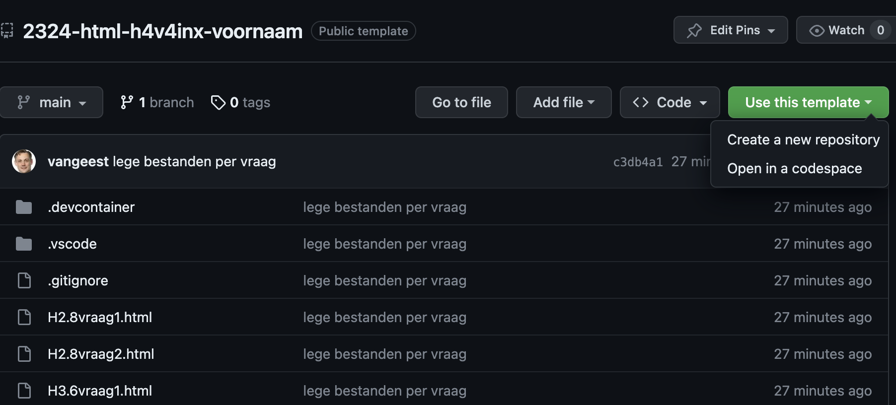
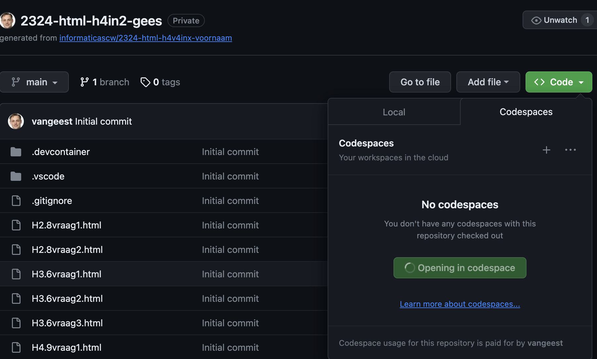
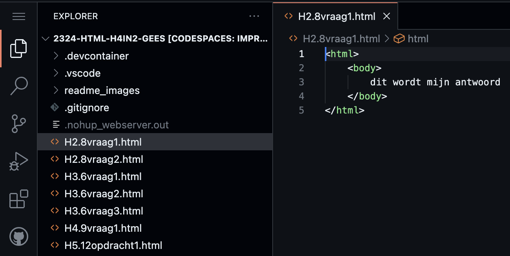
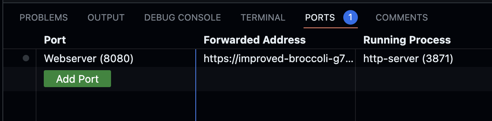
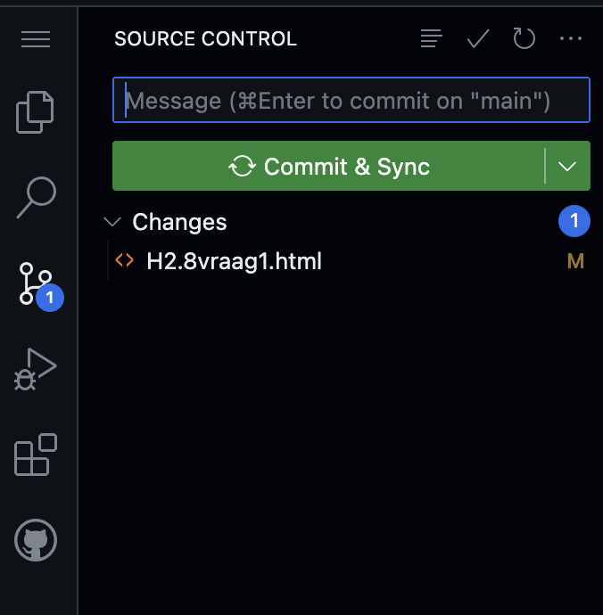

# Template voor oefenopgaven over HTML & Webdesign uit Fundament

## 1. Maak een kopie van dit template
- klik op groen knop "Use Template"
- klik op "Create New Repository"
- geef naam zoals jaar-html-klas-voornaam, bijvoorbeeld 2324-html-h4in2-sander
- kies private (niet public)

## 2. Open een Codespace van je eigen kopie
- klik op groen knop "Code"
- klik op tabje "Codespaces"
- klik op "Create Codespace on main"

## 3. Zet de antwoorden op de vragen en opdrachten in de .html bestanden.

## 4. Bekijk het resultaat in de Simple Browser.
- Als de simpel browser geopend is, klik op het reload knopje en kies je opgave
- Anders:
- Klik op Ports
- Ga met je muis op de regel "Webserver" staan
- Klik op het grijze icoontje rechts naast het wereldbolletje

## 5. Bewaar je antwoorden in GitHub.
- Klik op het icoontje met de twee streepjes en 3 bolletjes
- Type bij "Message" enkele woorden wat je gedaan hebt
- Klik op "Commit & Sync"

