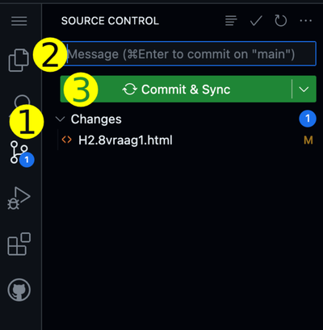

# HTML oefenopgaven uit Fundament 
Template voor het maken van oefenopgaven over HTML & Webdesign uit \
[Fundament Kernprogramma A: Vaardigheden 2. HTML & CSS hoofdstuk 1 tot en met 5](https://fundament-online.nl/leeromgeving/hoofdstuk.php?id=12181)

## 1. Bekijk code

- Open een Codespace

- Start een webserver in de terminal van de Codespace met het commando 
    ```
    npx -y vite
    ```
- Als je het commando knipt en plakt, dan verschijnt er de eerste keer links bovenin je scherm een popup waarin je toestemming moet geven.
- Om het commando uit te voeren druk je op de [Enter]-toets.

- Een popup verschijnt met de vraag of je een browser wilt openen verschijnt rechtonder in je scherm. Klik op de groene knop "In Browser Openen".

- Je ziet de inhoud van het `index.html` bestand in het geopende browserwindow. Klik op de link van de eerste opdracht om het resultaat te zien.


## 2. Maak nieuwe opdracht

- Maak een volgende opdracht van \
    [Fundament Kernprogramma A: Vaardigheden 2. HTML & CSS hoofdstuk 1 tot en met 5](https://fundament-online.nl/leeromgeving/hoofdstuk.php?id=12181)

- Bestanden maak je in de juiste mapjes in je codespace.

## 3. Bekijk het resultaat

- De aanpassingen worden automatisch in het browser-window getoond    

## 4. Bewaar je werk in GitHub

- Klik op het icoontje met de twee streepjes en 3 bolletjes (1)
- Type bij "Message" de opdracht waaraan je gewerkt hebt en enkele woorden wat je gedaan hebt (2)
- Klik op "Commit & Sync" (3)
  


## 5. Problemen oplossen

- Meer informatie over GitHub met Codespaces \
    https://stanislas.informatica.nu/help/codespaces
